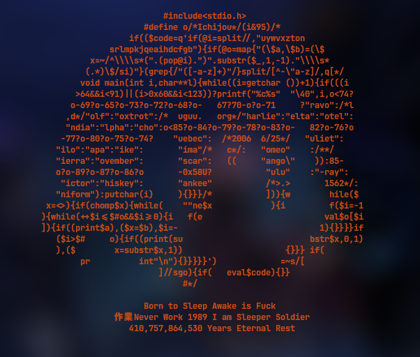
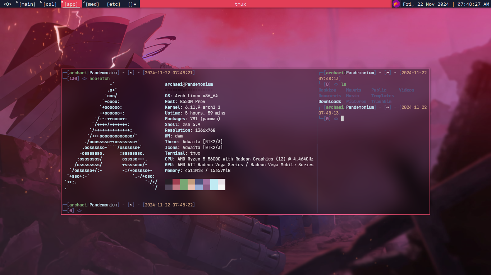
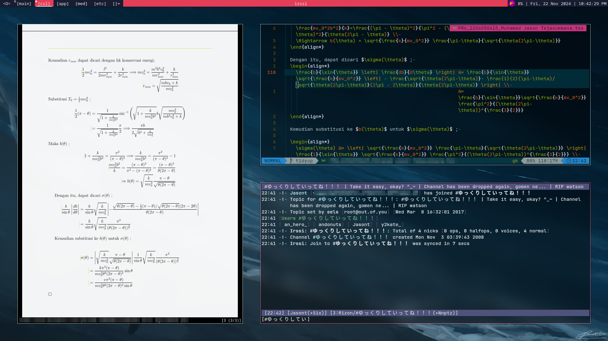

<h1>archaei's dotfiles</h1>

<br/>
<div align="center">
  <a href="https://github.com/JasonJasu/dotfiles">
    
  </a>
</div>
<br/>

[](https://youtu.be/Rh0QIxAVXF4)

|  |  |  |
| --------------------------------- | --------------------------------- | ---------------------------------- |

<br/>

Writing a detailed config because I've been changing rigs atleast thrice in a year; no time to remember nor configure stuff in this day and age. The dotfiles represented here have been used for atleast 4 years and still going strong. Nothing change much aside from personal customization and preferences. In other words; It's pretty damn stable.
Desktop Configs are based on X11.

# Table of Contents

- [System Configurations](#system-configurations)
  - [GRUB](#grub)
  - [Keybinds - caps2esc](#keybinds-caps2esc)
  - [Mirrorlist Setup](#mirrorlist-setup-for-the-based-only)
  - [AUR Package Manager](#aur-package-manager)
  - [Fonts](#fonts)
  - [git](#git)
- [Shell Configurations](#shell-configurations)
  - [zsh](#zsh)
- [Desktop Environment](#desktop-environment)
  - [Video Driver](#video-driver)
  - [X11](#x11)
  - [suckless - dwm and dmenu](#suckless---dwm-and-dmenu)
  - [Picom (Compositor)](#picom-compositor)
  - [Other Useful Softwares](#other-useful-softwares)
  - [Starting xinit](#starting-xinit)
- [Extras](#extras)
  - [Vimtex Configurations](#vimtex-configurations)

# System Configurations

## GRUB

[GRUB - ArchWiki](https://wiki.archlinux.org/title/GRUB)

There are some things to configure at grub; mainly the hibernation and appearances.

- Theme :
  Can be configured using the config file provided in `/boot/grub/themes/`.
  Need to also configure `/etc/default/grub` to load the theme at :

```bash
...
GRUB_THEME="/boot/grub/themes/customTheme/theme.txt"
...
```

Custom menus are provided in config files.

- Hibernation Sequence
  Detailed steps provided here :
  [Suspend and Hibernate - ArchWiki](https://wiki.archlinux.org/title/Power_management/Suspend_and_hibernate)
  `/etc/default/grub`

```bash
GRUB_CMDLINE_LINUX="resume=UUID=[UUID string for SWAP File/Partition]"
```

Then, load `resume` module through HOOKS in `/etc/mkinitcpio.conf`. Load order is
**very important**.

```bash
HOOKS=(... filesystems resume fsck)
```

reload all kernel modules using `mkinitcpio -P`.

## Keybinds - caps2esc

As the name says, it switches capslock key to esc and vice versa.

[Interception-tools - ArchWiki](https://wiki.archlinux.org/title/Interception-tools)
[ejmastnak caps2esc](https://ejmastnak.com/tutorials/arch/caps2esc/)

Using interception's key tools :

```bash
sudo pacman -S interception-caps2esc
```

configure `/etc/udevmon.yaml`

```bash
- JOB: "intercept -g $DEVNODE | caps2esc | uinput -d $DEVNODE"
  DEVICE:
    EVENTS:
      EV_KEY: [KEY_CAPSLOCK, KEY_ESC]
```

create systemd service for udevmon

`/etc/systemd/system/udevmon.service`

```bash
[Unit]
Description=udevmon
Wants=systemd-udev-settle.service
After=systemd-udev-settle.service

# Use `nice` to start the `udevmon` program with very high priority,
# using `/etc/udevmon.yaml` as the configuration file
[Service]
ExecStart=/usr/bin/nice -n -20 /usr/bin/udevmon -c /etc/udevmon.yaml

[Install]
WantedBy=multi-user.target
```

enable the service unit

```bash
systemctl enable udevmon.service
systemctl status udevmon
```

Done.

## Mirrorlist Setup (for the based only)

- Enabling x86 library

`/etc/pacman.conf`

```bash
# uncomment this part.
[multilib]
Include = /etc/pacman.d/mirrorlist
```

- Sorting server based on download speed

```bash
sudo pacman -S pacman-contrib
rankmirrors /etc/pacman.d/mirrorlist > $HOME/sortedlist
sudo mv /etc/pacman.d/mirrorlist /etc/pacman.d/mirrorlist.backup
sudo cp sortedlist /etc/pacman.d/mirrorlist
sudo pacman -Syu
```

## AUR Package Manager

```bash
sudo pacman -S base-devel
```

- paru

```bash
git clone https://aur.archlinux.org/paru.git
cd paru
nvim PKGBUILD # is this jit lejit?
makepkg -si # build
```

or if you want to use [gay](https://github.com/Jguer/yay), do the same step; just change the repo.

## Fonts

Install all necessary fonts :

```bash
sudo pacman -S $(cat fonts)
```

(preferrably, use above command.) or :

```bash
sudo pacman -S terminus-font ttf-bitstream-vera ttf-croscore gnu-free-fonts noto-fonts ttf-droid ttf-roboto ttf-ubuntu-font-family ttf-anonymous-pro ttf-hack ttf-inconsolata ttf-anonymous-pro ttf-fira-code ttc-iosevka ttf-jetbrains-mono ttf-roboto-mono adobe-source-code-pro-fonts ttf-fira-sans inter-font ttf-liberation ttf-opensans adobe-source-sans-fonts otf-crimson ttf-liberation ttf-junicode xorg-fonts-type1 ttf-scheherazade-new noto-fonts-cjk adobe-source-han-sans-kr-fonts noto-fonts noto-fonts-emoji libertinus-font otf-latin-modern otf-latinmodern-math ttf-jetbrains-mono-nerd
```

Check all installed fonts using [fontpreview](https://github.com/sdushantha/fontpreview).

## git

```bash
git config --global user.name "bogos binted"
git config --global user.email "twentycorpses@mybasement.com"
git config --global credential.helper store --file "path/to/store or dont bother at all"
```

# Shell Configurations

```bash
pacman -S tmux ripgrep zsh nvim # four horsemen of stage 5 testicular cancer
pacman -S thefuck # honourable mention
```

## Zsh

Using `.zshenv` in home, applying XDG base dir standard.
`$SHELLS_DIR` is in `$HOME/.config/shells/`.
`$ZDOTDIR` is in `$SHELLS_DIR/zsh/`.
`.zshrc` is in `$ZDOTDIR`.
Other envvars are provided in the content.

```bash
cp zshenv $HOME/.zshenv
cd config
cp nvim nvim_default shells vifm tmux $HOME/.config -r
source $HOME/.zshenv && source $ZDOTDIR/.zshrc
```

After applying some patches, install [oh-my-zsh](ohmy.zsh) and you should be done.

```bash
sh -c "$(curl -fsSL https://raw.githubusercontent.com/ohmyzsh/ohmyzsh/master/tools/install.sh)"
```

# Desktop Environment

These are the building blocks for the X11 desktop :

- [picom](https://github.com/jonaburg/picom) (compositor) <- Jonaburg's picom
- [dwm](https://dwm.suckless.org/) (window manager)
- [dmenu](http://tools.suckless.org/dmenu/) (dynamic menu)
- nitrogen / feh (wallpaper manager)
- clipmenud (clipboard manager)
- kitty (terminal)
- nerd fonts (mainly jetbrains mono)

## Video Driver

[AMDGPU](https://wiki.archlinux.org/title/AMDGPU), [NVIDIA](https://wiki.archlinux.org/title/NVIDIA), or [Intel Graphics](https://wiki.archlinux.org/title/Intel_graphics), pick one based off the graphics card your machine running.

## X11

Install xorg packages

```bash
cp config/X11 $HOME/.config/ -r
sudo pacman -S xorg xorg-xinit xorg-xrandr xorg-xrdb
```

## suckless - dwm and dmenu

```bash
mkdir $HOME/.Packages
cp packages/suckless $HOME/.Packages -r && cd $HOME/.Packages/suckless
```

```bash
cd dwm && nvim config.def.h makefile # check
sudo make clean install
# do the same with dmenu
```

## Picom (Compositor)

Using [jonaburg's fork](https://github.com/jonaburg/picom)

```bash
cp config/picom $HOME/.config -r
sudo pacman -S ninja rust
git clone https://github.com/jonaburg/picom
cd picom
meson --buildtype=release . build
ninja -C build
```

## Other Useful Softwares

```bash
sudo pacman -S nitrogen clipmenud flameshot kitty
```

## Starting xinit

Now that all is been set up, start dwm using xinit

```bash
startx
```

# Extras

## Vimtex Configurations

Install texlive, copy nvim config, update lazyvim :

```bash
sudo pacman -S nvim texlive tree-sitter
cp config/nvim $HOME/.config/ -r
nvim # Accessing lazyvim dashboard ; <Space>l
# <Leader>l to access vimtex. <Leader> as default is '\'.
```
